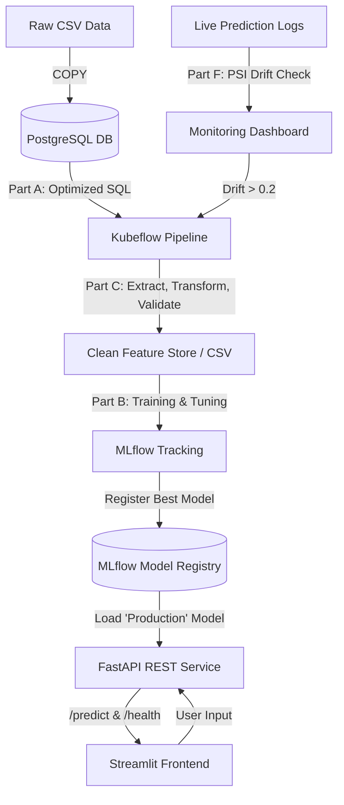

* **Output** **: Probability (0-1) and Binary Class (0=Stay, 1=Churn).**
* **Business Decision** **:**

1. **High Risk (Prob > 0.7)** **: Automatically trigger a personalized retention workflow (e.g., 20% discount email via ServiceNow/Marketing automation).**
2. **Medium Risk (0.4 - 0.7)** **: Flag for customer success team outreach.**
3. **Low Risk (< 0.4)** **: Upsell/cross-sell campaign**

# Customer Churn Prediction MLOps System

End-to-end machine learning system predicting 90-day customer churn. Built with PostgreSQL, Scikit-Learn, MLflow, Kubeflow Pipelines, FastAPI, Streamlit, and GitHub Actions.

## Architecture Diagram

